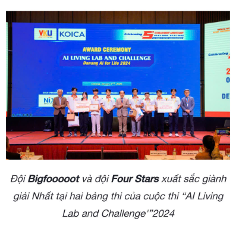
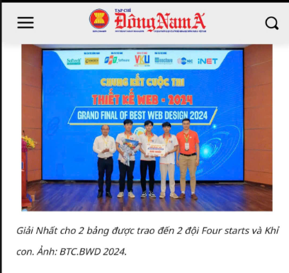

<h1 align="center">Hi 👋, I'm Le Trung Viet</h1>

<h3 align="center">
Full Stack Developer • AI Enthusiast • Software Engineering Student
</h3>

  

  

  

  

---

# 🚀 About Me

- 🎓 Third-year Software Engineering student at **Vietnam-Korea University of Information and Communication Technology (VKU)**
- 💻 Passionate about **Full Stack Web Development**
- 🤖 Exploring **Artificial Intelligence (AI)** & **Internet of Things (IoT)**
- 🌱 Currently learning **Machine Learning**, **Cloud Computing** and **System Design**
- ⚡ I enjoy building software that solves real-world problems.

---

# 💻 Tech Stack

### 🖥 Programming Languages

### 🌐 Frontend

### ⚙️ Backend

### 🗄 Database & Cloud

---

# 📊 GitHub Statistics

  
  

  

---

# 📈 Contribution Graph

  

---

# 🏆 Achievements

  
  

---

